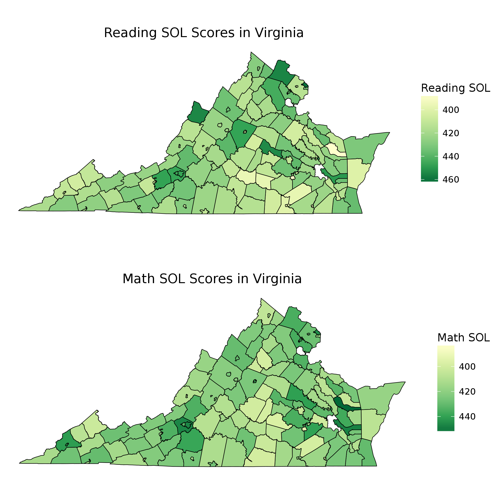
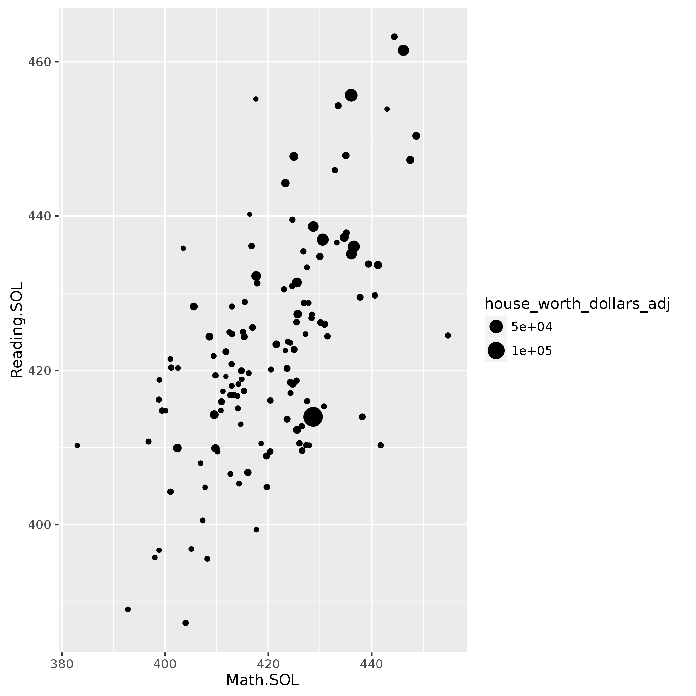

# STAT6021 Final Project

## Results

Reading vs Math, including home values.

## Usage

### Initial Setup

All the packages must be installed and an active [Census API key](http://api.census.gov/data/key_signup.html) must be installed.

Once the API key is placed in `acs.init.R`, the script can be run to ensure packages are installed and ACS API key and data are cached.

### Pipeline Usage

The Makefile contains the pipeline. To run the full set, execute `make` or `make clean && make all`.

### Manual Usage

Extract all zip archives to the root directory (on OS X, `unzip -o data\*.zip`)

Run each script in the pipeline manually:

 * `education_data_wrangling.R`
 * `acs_acquisition.R`
 * `acs_wrangling.R`
 * `data_merge.R`
 * `data_viz.R`

For each, run `Rscript script_name.R`. Or, in RStudio, open `script_name.R`, set the working directory to the project root (ie. Session -> Set Working Directory -> To Source File Location) and run the script. `some_data.csv` will be written to the project directory.

The end results are placed in the `images/` directory.
